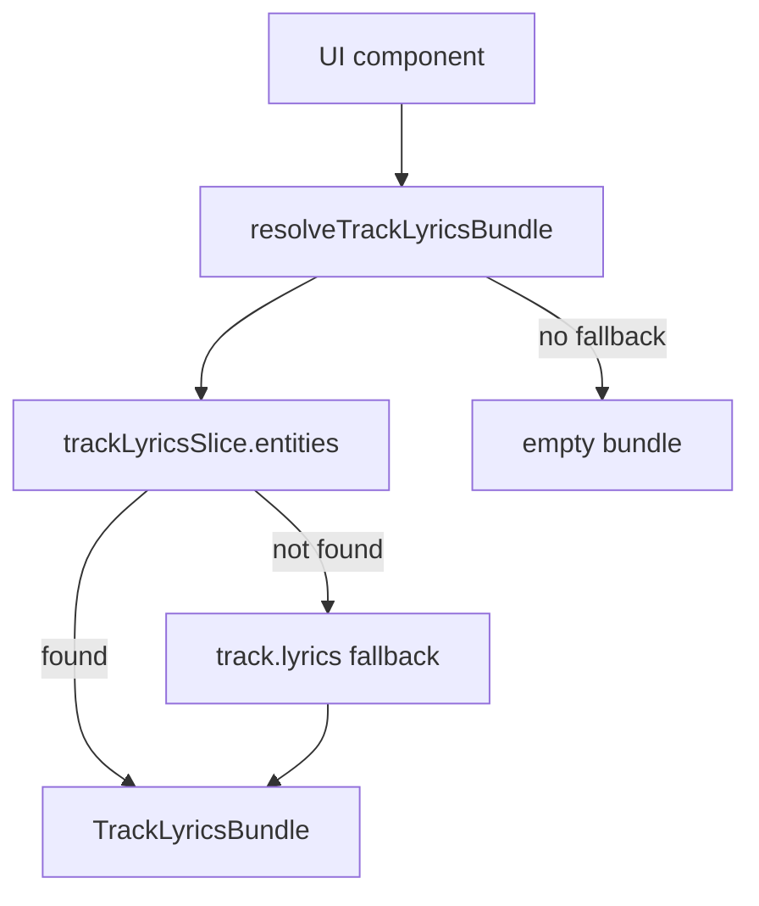
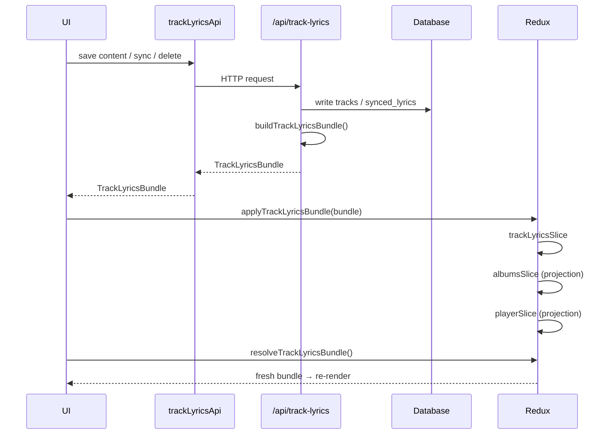

# Lyrics Synchronization Architecture

This document describes how lyrics text and timed synchronization work in the application. It is written for developers who need to read, write, or extend the lyrics subsystem without spelunking through the entire codebase.

---

## Purpose

Lyrics data used to live in several places at once: embedded track fields, separate sync APIs, client-side caches, and dashboard-specific helpers. Each layer could compute synchronization status differently, so the UI could show **Preview** after a delete, display a **“Not synchronized”** badge on synced tracks, or render stale karaoke lines in the player until a full page reload.

The current architecture solves this by introducing a single canonical object — **`TrackLyricsBundle`** — and a single runtime store — **`trackLyricsSlice`**. Every surface (dashboard cards, preview modal, sync editor, player, public album playback) reads the same bundle and derives UI behavior from the same `state` field.

Goals:

- One authoritative synchronization state per track.
- Immediate, consistent UI updates after any mutation.
- Shared rules between client and server (no divergent “is this synced?” heuristics).
- A clear extension point for future features (AI sync, version history, collaboration) without parallel state trees.

---

## Architecture Decision

The application intentionally uses a **normalized Redux entity store** (`trackLyricsSlice`) instead of treating album models or player playlist models as authoritative for lyrics synchronization.

Album and player data still carry an embedded `track.lyrics` bundle, but only as a **transport and hydration projection**. Runtime decisions — badges, preview availability, karaoke, action buttons — always flow through the slice-first resolver.

This decision was made to eliminate duplicated runtime state and guarantee that every UI surface renders the same `TrackLyricsBundle` after any mutation, without waiting for album list rebuilds or playlist refresh side effects.

Alternatives considered and rejected:

- **Embedded-only model** (read `track.lyrics` on album/track objects) — stale after edits; dashboard and player could diverge.
- **Client-side sync cache** (localStorage, TTL) — second source of truth; hard to invalidate.
- **Per-surface loaders** (dashboard API, player API, public widget) — duplicated sync heuristics and inconsistent `state`.

The chosen model — **server-built bundle → Redux entities → resolver → UI** — keeps one object shape and one state machine end to end.

---

## Core Principles

These rules are non-negotiable. Breaking any of them reintroduces the bugs the architecture was designed to eliminate.

| Principle                                             | Meaning                                                                                                                                                                                                                    |
| ----------------------------------------------------- | -------------------------------------------------------------------------------------------------------------------------------------------------------------------------------------------------------------------------- |
| **Single runtime source of truth**                    | At runtime, `trackLyricsSlice.entities` is authoritative. Denormalized copies on albums or the player playlist are projections, not decision-makers.                                                                       |
| **One synchronization state resolver**                | `resolveLyricsSyncState()` (and its helper `isTimedSync()`) is the only function that maps raw content + timed lines → `empty` / `text-only` / `synced`. Used on both client and server via `projectLyricsBundleFields()`. |
| **One read path**                                     | UI reads through `resolveTrackLyricsBundle()` or `selectTrackLyricsBundle()`. Never inspect embedded `track.lyrics` for runtime decisions except as hydration fallback passed into the resolver.                           |
| **One write path**                                    | Mutations go through `/api/track-lyrics`, return a fresh `TrackLyricsBundle`, and propagate via `applyTrackLyricsBundle()`.                                                                                                |
| **No duplicated synchronization logic**               | Do not reimplement “does this track have sync?” in components, widgets, or ad-hoc helpers.                                                                                                                                 |
| **No runtime decisions from embedded hydration data** | `track.lyrics` on album/track models exists to seed Redux before or between fetches. After hydration, the slice wins.                                                                                                      |

---

## Runtime Architecture

```
Database
  tracks.content, tracks.authorship
  synced_lyrics.synced_lyrics, synced_lyrics.updated_at
        │
        ▼
buildTrackLyricsBundle()          ← netlify/functions/lib/track-lyrics.ts
  (loads rows, calls composeTrackLyricsBundle)
        │
        ▼
TrackLyricsBundle                 ← server-built, state already resolved
        │
        ├─ GET /api/track-lyrics
        ├─ PUT  (content | sync)
        ├─ DELETE (remove sync)
        └─ GET /api/albums (embedded per track as track.lyrics)
        │
        ▼
trackLyricsSlice.entities         ← Redux runtime source of truth
  key: `${albumId}:${trackId}:${lang}`
        │
        ▼
resolveTrackLyricsBundle()        ← prefer slice; fallback for hydration only
        │
        ├── Dashboard (TrackLyricsPanel, badges, actions)
        ├── Preview (PreviewLyricsModal)
        ├── Sync Editor (SyncLyricsModal — loads via API, saves via apply)
        ├── Player (useLyricsContent → karaoke / plain text)
        └── Public pages (same Player path on album playback)
```

### Layer responsibilities

| Layer               | Location                                        | Responsibility                                                                                                                                                    |
| ------------------- | ----------------------------------------------- | ----------------------------------------------------------------------------------------------------------------------------------------------------------------- |
| **Database**        | `tracks`, `synced_lyrics`                       | Persistent storage. Text lives on `tracks`; timed lines live in `synced_lyrics` (per user, album, track, lang). Legacy `tracks.synced_lyrics` column was removed. |
| **Bundle builder**  | `netlify/functions/lib/track-lyrics.ts`         | `buildTrackLyricsBundle()` loads DB rows and `composeTrackLyricsBundle()` assembles a bundle with server-resolved `state`.                                        |
| **HTTP API**        | `netlify/functions/track-lyrics.ts`             | Canonical REST surface for read/write/delete. Legacy `/api/synced-lyrics` delegates here but should not be used by new client code.                               |
| **Client API**      | `src/entities/lyrics/api/trackLyricsApi.ts`     | Typed fetch/save/delete wrappers; always return `TrackLyricsBundle`.                                                                                              |
| **Redux store**     | `src/entities/lyrics/model/trackLyricsSlice.ts` | Runtime entity map. Hydrated from `fetchAlbums.fulfilled` and updated by `applyTrackLyricsBundle`.                                                                |
| **Selectors**       | `src/entities/lyrics/lib/selectors.ts`          | `selectTrackLyricsBundle`, `resolveTrackLyricsBundle`, `selectLyricsSyncState`.                                                                                   |
| **Mutation action** | `src/entities/lyrics/model/actions.ts`          | `applyTrackLyricsBundle` — fans out to slice, albums, and player.                                                                                                 |
| **UI**              | Dashboard, Player, modals                       | Consume resolved bundles only; never compute sync state independently.                                                                                            |

### Denormalized projections

When `applyTrackLyricsBundle` runs, listeners also patch:

- **`albumsSlice`** — `patchAlbumsWithTrackLyrics()` updates `track.content`, `track.authorship`, `track.lyrics`.
- **`playerSlice`** — playlist entries get the same embedded bundle for transport/hydration.

These copies keep album lists and the player playlist in sync for display and offline-first hydration. They are **not** an alternate source of truth: always prefer `trackLyricsSlice` via the resolver.

---

## Data Model

### `TrackLyricsBundle`

Defined in `src/shared/lib/lyrics/types.ts`:

```typescript
interface TrackLyricsBundle {
  albumId: string;
  trackId: string;
  lang: string; // canonical storage lang ('ru' | 'en')
  content: string; // plain lyrics text
  authorship?: string;
  syncedLines: SyncedLyricsLine[] | null;
  state: 'empty' | 'text-only' | 'synced';
  syncedAt: string | null; // ISO timestamp from synced_lyrics.updated_at
}
```

### Canonical vs derived fields

| Field                          | Kind                   | Notes                                                                                                        |
| ------------------------------ | ---------------------- | ------------------------------------------------------------------------------------------------------------ |
| `albumId`, `trackId`, `lang`   | **Canonical**          | Identity. Entity key: `trackLyricsEntityKey(albumId, trackId, lang)`.                                        |
| `content`, `authorship`        | **Canonical**          | Stored on `tracks` (with locale-specific authorship rules on the server).                                    |
| `syncedLines` (raw timed rows) | **Canonical input**    | Stored in `synced_lyrics.synced_lyrics` JSON.                                                                |
| `state`                        | **Derived**            | Computed by `resolveLyricsSyncState()` whenever a bundle is built or projected. Never set arbitrarily by UI. |
| `syncedLines` (on bundle)      | **Derived projection** | Non-null **only** when `state === 'synced'`. Otherwise forced to `null` by `projectLyricsBundleFields()`.    |
| `syncedAt`                     | **Canonical metadata** | From DB; informational, not used for state resolution.                                                       |

### `SyncedLyricsLine`

Standard timed line shape (`text`, `startTime`, optional `endTime`). A line with `startTime: 0` alone does **not** count as timed sync — see `isTimedSync()`.

---

## Synchronization States

There are exactly three valid states:

| State           | Meaning                                                 | UI implications                                                          |
| --------------- | ------------------------------------------------------- | ------------------------------------------------------------------------ |
| **`empty`**     | No lyrics text and no timed sync.                       | Show “Add lyrics” empty state; no preview, no badge, no karaoke.         |
| **`text-only`** | Plain text exists; no timed lines with `startTime > 0`. | Edit + Sync actions; “Not synchronized” badge; plain text in player.     |
| **`synced`**    | At least one timed line has `startTime > 0`.            | Edit + Preview + Sync actions; karaoke in player; preview modal enabled. |

### How `resolveLyricsSyncState()` decides

Implementation: `src/shared/lib/lyrics/resolveLyricsSyncState.ts`

```
1. If isTimedSync(syncedLines) → 'synced'
     isTimedSync = any line with (startTime ?? 0) > 0

2. Else if content.trim() is non-empty → 'text-only'

3. Else → 'empty'
```

Server-side bundle assembly uses the same functions via `projectLyricsBundleFields()` in `composeTrackLyricsBundle()`.

### State diagram

```mermaid
stateDiagram-v2
  [*] --> empty: no content,\nno timed lines

  empty --> text-only: save lyrics text
  text-only --> empty: delete all text

  text-only --> synced: save sync with\nstartTime > 0 on any line
  synced --> text-only: delete sync\n(or save with no timed lines)

  note right of synced
    Preview, karaoke, and
    synced preview lines
    require this state
  end note

  note right of text-only
    Badge: "Not synchronized"
    Player shows plain text
  end note
```

---

## Read Flow

### `selectTrackLyricsBundle(state, albumId, trackId, lang)`

Direct lookup in `trackLyricsSlice.entities`. Returns `undefined` if not hydrated yet.

Use when you know the exact lang key (rare in UI — prefer the resolver).

### `resolveTrackLyricsBundle(state, albumId, trackId, fallback?)`

**The standard read path for all UI.**

Resolution order:

1. If `fallback?.lang` is set, try that lang in the slice.
2. Try `'ru'`, then `'en'` in the slice.
3. If still missing, return `fallback` (embedded `track.lyrics` or synthesized hydration bundle).
4. If no fallback, return a synthetic `empty` bundle.

This guarantees:

- After any mutation, the slice entity (updated by `applyTrackLyricsBundle`) wins over stale embedded data.
- Before albums finish loading, embedded album/track bundles still allow rendering.

### Why embedded `track.lyrics` is only a hydration fallback

Album API responses embed a `TrackLyricsBundle` on each track for convenience and initial paint. That embedding can become stale if:

- The user edits lyrics in a modal while `albumsData` local state has not rebuilt yet.
- Multiple tabs or async fetches reorder updates.

Passing `track.lyrics` **into** `resolveTrackLyricsBundle(..., fallback)` — never reading it directly for `state` — ensures the slice is preferred whenever present.

### Read flow diagram



---

## Write Flow

All mutations follow the same pattern:

```
User action
  → trackLyricsApi (PUT or DELETE /api/track-lyrics)
  → Server persists + buildTrackLyricsBundle()
  → Response: TrackLyricsBundle
  → dispatch(applyTrackLyricsBundle(bundle))
  → slice + albums + player updated
  → UI re-reads via resolveTrackLyricsBundle()
```

### Mutations

| Operation                  | API                                  | Client function               | Resulting state                                                                   |
| -------------------------- | ------------------------------------ | ----------------------------- | --------------------------------------------------------------------------------- |
| **Save lyrics text**       | `PUT /api/track-lyrics?type=content` | `saveTrackLyricsContentApi()` | `text-only` or `empty` (sync preserved only if fingerprint matches — server rule) |
| **Save synchronization**   | `PUT /api/track-lyrics?type=sync`    | `saveTrackLyricsSyncApi()`    | `synced` if any line has `startTime > 0`                                          |
| **Delete synchronization** | `DELETE /api/track-lyrics`           | `deleteTrackLyricsSyncApi()`  | `text-only` if content remains, else `empty`                                      |

Every mutation response is a complete, server-resolved bundle. Callers must dispatch `applyTrackLyricsBundle(bundle)` — do not manually patch `albumsData`, playlist lyrics, or slice entities.

### Mutation flow diagram



---

## TrackLyricsBundle Lifecycle

Read Flow and Write Flow describe individual paths. The diagram below shows the **full round trip** — from persistence through UI and back to persistence after a user action.

```
                    ┌─────────────────────────────────────────┐
                    │              Database                   │
                    │  tracks.content / tracks.authorship     │
                    │  synced_lyrics.synced_lyrics              │
                    └─────────────────┬───────────────────────┘
                                      │
                                      ▼
                         buildTrackLyricsBundle()
                         composeTrackLyricsBundle()
                                      │
                                      ▼
                              TrackLyricsBundle
                                      │
                    ┌─────────────────┼─────────────────┐
                    │                 │                 │
                    ▼                 ▼                 ▼
            GET /api/track-lyrics   PUT / DELETE   GET /api/albums
            (explicit fetch)        (mutations)    (embedded track.lyrics)
                    │                 │                 │
                    └─────────────────┼─────────────────┘
                                      ▼
                         trackLyricsSlice.entities
                         (applyTrackLyricsBundle /
                          fetchAlbums.fulfilled)
                                      │
                                      ▼
                         resolveTrackLyricsBundle()
                                      │
                    ┌─────────────────┼─────────────────┐
                    ▼                 ▼                 ▼
               Dashboard          Preview           Player
               Sync Editor        badges            public pages
                    │                 │                 │
                    └─────────────────┼─────────────────┘
                                      ▼
                              User action
                         (add / edit / sync / delete)
                                      │
                                      ▼
                         trackLyricsApi → /api/track-lyrics
                                      │
                                      ▼
                         buildTrackLyricsBundle()  ──► DB write
                                      │
                                      ▼
                              TrackLyricsBundle
                                      │
                                      ▼
                         applyTrackLyricsBundle()
                                      │
                                      └──► (cycle repeats)
```

**Initial load:** albums fetch embeds bundles → `fetchAlbums.fulfilled` hydrates the slice → UI resolves from slice.

**Explicit load:** sync editor opens → `fetchTrackLyricsBundle()` → caller may dispatch `applyTrackLyricsBundle` on save only; read path still goes through resolver on next render.

**After mutation:** always close the loop with `applyTrackLyricsBundle` so the slice updates before the next `resolveTrackLyricsBundle()` call.

```mermaid
flowchart LR
  DB[(Database)]
  BUILD[buildTrackLyricsBundle]
  BUNDLE[TrackLyricsBundle]
  API[/api/track-lyrics]
  SLICE[trackLyricsSlice]
  RESOLVE[resolveTrackLyricsBundle]
  UI[Dashboard / Preview / Player]
  ACTION[User action]

  DB --> BUILD --> BUNDLE --> API --> SLICE --> RESOLVE --> UI
  UI --> ACTION --> API --> BUILD --> DB
  BUILD --> BUNDLE
  BUNDLE --> SLICE
```

---

## Dashboard

### `TrackLyricsPanel`

Location: `src/pages/UserDashboard/components/albums/TrackLyricsPanel.tsx`

```typescript
const lyrics = useAppSelector((state) =>
  resolveTrackLyricsBundle(state, albumId, track.id, track.lyrics)
);
```

From the resolved bundle it derives **everything**:

- Empty vs card layout (`lyrics.state === 'empty'`)
- Preview snippet lines (`getLyricsPreviewLines(lyrics)`)
- Action buttons (`getLyricsCardActions(lyrics)` → edit / preview / sync / add)
- Badge (`LyricsSyncStatusBadge` — only shows for `text-only`)

The panel **never** inspects `track.lyrics.state` directly. It never checks `syncedLines.length`, `content` emptiness, or legacy fields to infer sync status.

### Handlers

`UserDashboard` action handlers (`handleLyricsAction`, `getTrackLyricsText`, etc.) use the same resolver via `resolveDashboardTrackLyrics()`, then pass the bundle into modals (Preview) or call the write API and `applyTrackLyricsBundle`.

---

## Player

Location: `src/features/player/ui/AudioPlayer/hooks/useLyricsContent.ts`

The player uses the **same read architecture as the dashboard**:

```typescript
const lyricsBundle = useAppSelector((state) =>
  resolveTrackLyricsBundle(state, canonicalAlbumId, currentTrack.id, fallback)
);
```

Where `fallback` is built from playlist-embedded `currentTrack.lyrics` (or legacy `content` / `authorship`) only until the slice is populated.

From the resolved bundle the hook sets:

- `plainLyricsContent` — when `state !== 'empty'`
- `hasSyncedLyricsAvailable` — when `state === 'synced'`
- `syncedLyrics` (local karaoke lines) — built from `bundle.syncedLines` + authorship tail

`AudioPlayer` uses `lyricsBundle?.state === 'synced'` for the lyrics toggle hint — not `currentTrack.lyrics.state` directly.

Public album pages use the same `AudioPlayer` / `PlayerShell` path; there is no separate public lyrics stack.

---

## Preview

`PreviewLyricsModal` receives a `TrackLyricsBundle` prop from its parent (already resolved at open time).

Preview availability is gated exclusively by:

```typescript
const isSynced = lyrics.state === 'synced';
```

The parent (`handleLyricsAction` with action `'prev'`) refuses to open preview unless the resolved bundle is `synced`. Preview renders timed lines from `lyrics.syncedLines` when synced, otherwise plain `lyrics.content`.

Preview does not fetch its own sync state and does not read `track.lyrics` from album models.

---

## Sync Editor

Location: `src/pages/UserDashboard/components/modals/lyrics/SyncLyricsModal.tsx`

The sync editor maintains **two distinct layers of state**:

| Layer                  | What it is                                      | Source of truth?                                               |
| ---------------------- | ----------------------------------------------- | -------------------------------------------------------------- |
| **Canonical bundle**   | Saved server state                              | Yes — after save, this is what `applyTrackLyricsBundle` writes |
| **Draft editor state** | Local `syncedLines`, timing buttons, dirty flag | No — ephemeral until Save                                      |

On open, the modal loads via `fetchTrackLyricsBundle()` (API → fresh server bundle), then builds editor rows with `buildSyncEditorLinesFromBundle()`.

On save:

- If `isTimedSync(cleanLines)` → `saveTrackLyricsSyncApi()`
- Else → `deleteTrackLyricsSyncApi()` (clears sync row; bundle becomes `text-only` or `empty`)

`isTimedSync()` on draft lines is **validation before persistence**, not a second runtime state machine. The saved bundle’s `state` always comes back from the server.

After save, `onSave(bundle)` in `UserDashboard` dispatches `applyTrackLyricsBundle(bundle)`.

---

## Architecture Invariants

Never break these:

1. **`trackLyricsSlice` is the only runtime source of truth** for lyrics synchronization state.
2. **`resolveLyricsSyncState()` is the only synchronization resolver** (client and server share it).
3. **`resolveTrackLyricsBundle()` is the only runtime read path** for UI decisions (with `selectTrackLyricsBundle` for direct keyed access when appropriate).
4. **`applyTrackLyricsBundle()` is the only mutation propagation mechanism** — no manual multi-store patches after save.
5. **UI components must never implement synchronization logic independently** — read `bundle.state`, use shared helpers (`getLyricsActionsForState`, `getLyricsPreviewLinesFromBundle`).
6. **Embedded `track.lyrics` may only be used as hydration fallback** passed into `resolveTrackLyricsBundle`, never as the authority for badges, preview, or karaoke.
7. **Preview, badges, karaoke, action buttons, and sync status must all originate from the same `TrackLyricsBundle`** resolved through the slice-first path.

---

## Forbidden Patterns

Use this list during code review. If a PR does any of the following, it violates the architecture.

**Never:**

- Read synchronization state directly from `track.lyrics` (e.g. `track.lyrics?.state === 'synced'`). Pass embedded data into `resolveTrackLyricsBundle()` as fallback only.
- Compute “is synced” in UI components (checking `syncedLines.length`, `startTime > 0`, or plain `content` to infer sync status). Use `bundle.state` from the resolver.
- Patch `albumsData`, `setAlbumsData`, or album track objects manually after a lyrics save. Dispatch `applyTrackLyricsBundle` instead.
- Store synchronization status in local React state as an authority (e.g. `hasSyncedLyrics` derived independently of the resolved bundle). Draft editor timing state in `SyncLyricsModal` is the only exception — and it is not canonical until saved.
- Introduce additional lyrics caches (localStorage, sessionStorage, TTL maps, module-level memo caches for sync status).
- Skip `applyTrackLyricsBundle()` after a mutation that returns `TrackLyricsBundle`.
- Add a parallel API client for sync (legacy `/api/synced-lyrics` as primary write path, direct `save-synced-lyrics`, etc.).
- Reintroduce `track.syncedLyrics` or any field outside `TrackLyricsBundle` for runtime sync decisions.

**Red flags in diff:**

```typescript
// ❌ Forbidden
if (track.lyrics?.state === 'synced') { ... }
setAlbumsData(prev => /* patch track lyrics */)
const hasSync = lines.some(l => l.startTime > 0) // in a component, for UI gating

// ✅ Correct
const bundle = resolveTrackLyricsBundle(state, albumId, trackId, track.lyrics)
if (bundle.state === 'synced') { ... }
dispatch(applyTrackLyricsBundle(serverBundle))
```

---

## Adding New Features

Future lyrics features must extend this architecture — not bypass it.

### Synchronization history

- Store history in the database; expose read endpoints that still return or compose `TrackLyricsBundle` (or a superset type that includes history metadata).
- Apply active version through `applyTrackLyricsBundle` so all UI updates uniformly.
- Do not add a parallel “current sync” field on tracks.

### AI synchronization

- AI produces candidate `SyncedLyricsLine[]` in the sync editor draft layer.
- Persist only through `saveTrackLyricsSyncApi()` so the server resolves `state`.
- Never write timed lines directly to Redux or album models.

### Multiple lyric versions

- Extend entity keys or add version id to the bundle; keep `trackLyricsSlice.entities` as the runtime map.
- `resolveTrackLyricsBundle` may gain a version parameter, but resolution rules stay centralized.
- Avoid separate per-version sync flags on `TracksProps`.

### Collaborative editing

- Real-time patches should converge on `TrackLyricsBundle` updates via `applyTrackLyricsBundle`.
- Operational transform / CRDT state is draft-only until saved; canonical state still comes from the server bundle.

**Checklist for any new feature:**

- [ ] Reads through `resolveTrackLyricsBundle` / `selectTrackLyricsBundle`
- [ ] Writes through `/api/track-lyrics` → `applyTrackLyricsBundle`
- [ ] Uses `resolveLyricsSyncState` for any new server-side projection
- [ ] Does not introduce `track.syncedLyrics`, localStorage sync cache, or TTL-based lyrics cache
- [ ] Does not compute “is synced?” in a component

---

## Migration Notes

The following were removed from the runtime architecture (they must not be reintroduced):

| Removed                                                                                    | Replacement                                                                      |
| ------------------------------------------------------------------------------------------ | -------------------------------------------------------------------------------- |
| **`track.syncedLyrics` field** on client models                                            | `track.lyrics?: TrackLyricsBundle` (embedded projection only)                    |
| **Legacy `@features/syncedLyrics` client library**                                         | `@entities/lyrics/api/trackLyricsApi`                                            |
| **Separate save/load sync endpoints as primary path**                                      | Unified `/api/track-lyrics`                                                      |
| **`save-synced-lyrics` function**                                                          | Deleted; use `track-lyrics`                                                      |
| **TTL / localStorage synced-lyrics cache**                                                 | Redux `trackLyricsSlice` + no-store API fetches                                  |
| **Independent sync editors** (`EditSyncLyrics`, `EditTrackText`, dashboard editor widgets) | Dashboard modals + `SyncLyricsModal`                                             |
| **`SyncedLyricsDisplay` widget with its own loader**                                       | Player karaoke via `useLyricsContent`                                            |
| **Dashboard track status helpers** (`trackStatus`, duplicated badge logic)                 | `LyricsSyncStatusBadge` + `getLyricsActionsForState`                             |
| **`tracks.synced_lyrics` DB column**                                                       | `synced_lyrics` table (see migration `059_drop_tracks_synced_lyrics_column.sql`) |
| **Multiple runtime sources of truth** (albumsData lyrics, cache, playlist, slice)          | Slice-first resolver with projections updated by `applyTrackLyricsBundle`        |

The `/api/synced-lyrics` route may still exist as a thin delegate for backward compatibility. New code must use `/api/track-lyrics` only.

---

## Testing

When changing this subsystem, manually verify every path below. Automated tests cover resolver and slice behavior (`selectors.test.ts`, `trackLyricsSlice.test.ts`, `useLyricsContent.resolve.test.ts`, `resolveLyricsSyncState.test.ts`); these scenarios catch integration regressions.

| Scenario                                        | What to verify                                                                                               |
| ----------------------------------------------- | ------------------------------------------------------------------------------------------------------------ |
| **Add lyrics**                                  | Track moves from `empty` → `text-only`; badge shows “Not synchronized”; sync action available.               |
| **Edit lyrics**                                 | Content updates everywhere without reload; sync preserved only when server fingerprint rules allow.          |
| **Delete lyrics** (clear all text)              | State → `empty`; empty state UI; no preview/karaoke.                                                         |
| **Save synchronization**                        | State → `synced`; preview action appears; badge hidden; player karaoke works.                                |
| **Delete synchronization**                      | State → `text-only`; preview disappears **immediately** (no reload); badge returns; player shows plain text. |
| **Clear all line timings + Save** (sync editor) | Sync row removed; state → `text-only`; not stuck as `synced`.                                                |
| **Preview**                                     | Opens only when `state === 'synced'`; timed lines follow playback.                                           |
| **Player karaoke**                              | Highlighted lines match bundle; toggling lyrics respects `state`; no stale sync after delete.                |
| **Public page**                                 | Same player behavior on album page for anonymous/listener users.                                             |

**Regression checklist:**

- [ ] Add lyrics
- [ ] Edit lyrics
- [ ] Delete lyrics (empty text)
- [ ] Save synchronization
- [ ] Delete synchronization
- [ ] Preview modal
- [ ] Player karaoke + plain text
- [ ] Public album page playback

Run relevant unit tests:

```bash
npx jest src/entities/lyrics src/shared/lib/lyrics \
  src/features/player/ui/AudioPlayer/hooks/__tests__/useLyricsContent.resolve.test.ts \
  netlify/functions/lib/__tests__/track-lyrics.test.ts
```

---

## Debugging

If lyrics behave incorrectly, follow this order. **Do not start with `albumsData` or embedded `track.lyrics`** — they are often stale projections.

### 1. Inspect `TrackLyricsBundle` in Redux

Open Redux DevTools → `trackLyrics.entities` → find key `` `${albumId}:${trackId}:${lang}` ``.

Check:

- `state` — `empty` | `text-only` | `synced`
- `content`, `syncedLines`, `syncedAt`
- Whether the entity exists at all (missing → hydration fallback may be in use)

### 2. Verify `resolveTrackLyricsBundle()`

In the component or hook, confirm the read path uses the resolver with fallback — not raw `track.lyrics`.

Ask:

- Is the slice entity present but ignored because the component reads embedded data directly?
- Does `albumId` in the resolver match the bundle key (check `albumMeta.albumId`, `player.albumId`, fallback album id)?

### 3. Verify `applyTrackLyricsBundle()` ran after the last mutation

After save/delete, Redux should show:

- Updated `trackLyrics.entities[key]`
- Patched `albums.dashboard.data[].tracks[].lyrics` (projection)
- Patched `player.playlist[].lyrics` if the track is queued

If the slice updated but UI did not, the component is likely not subscribing via `useAppSelector` + resolver.

If the slice did **not** update, the mutation path skipped `applyTrackLyricsBundle`.

### 4. Verify the server response

Network tab → `/api/track-lyrics` → response `data` must be a full bundle with server-resolved `state`.

If the server returns wrong `state`, debug `composeTrackLyricsBundle` / DB rows (`tracks.content`, `synced_lyrics.synced_lyrics`), not the UI first.

### 5. Never debug `albumsData` first

Local dashboard state (`albumsData`) rebuilds asynchronously from `albumsFromStore`. It can lag behind `trackLyricsSlice` by one render cycle or more.

Symptoms of debugging the wrong layer:

- “Preview still visible after delete until reload” → reading snapshot or `albumsData` instead of resolver.
- “Badge correct in Redux but wrong in UI” → component not using `resolveTrackLyricsBundle`.

### Quick symptom map

| Symptom                                   | Likely cause                                                       |
| ----------------------------------------- | ------------------------------------------------------------------ |
| Stale sync status after save/delete       | Missing `applyTrackLyricsBundle` or direct `track.lyrics` read     |
| Preview open when `state !== 'synced'`    | Modal snapshot; parent did not re-resolve before open              |
| Player karaoke out of sync with dashboard | Player not using resolver; playlist embed stale                    |
| `text-only` but timed lines in DB         | Server `isTimedSync` rule — lines need `startTime > 0`             |
| Empty slice entity                        | Album fetch not completed; check `fetchAlbums.fulfilled` hydration |

---

## Key file reference

| Concern                             | Path                                                                      |
| ----------------------------------- | ------------------------------------------------------------------------- |
| Types & state resolver              | `src/shared/lib/lyrics/`                                                  |
| UI helpers (actions, preview lines) | `src/shared/lib/lyrics/lyricsUiHelpers.ts`                                |
| Redux slice                         | `src/entities/lyrics/model/trackLyricsSlice.ts`                           |
| Selectors                           | `src/entities/lyrics/lib/selectors.ts`                                    |
| Mutation action                     | `src/entities/lyrics/model/actions.ts`                                    |
| Client API                          | `src/entities/lyrics/api/trackLyricsApi.ts`                               |
| Server builder                      | `netlify/functions/lib/track-lyrics.ts`                                   |
| HTTP handler                        | `netlify/functions/track-lyrics.ts`                                       |
| Album projection patch              | `src/entities/album/lib/patchAlbumTrackLyrics.ts`                         |
| Dashboard panel                     | `src/pages/UserDashboard/components/albums/TrackLyricsPanel.tsx`          |
| Player read hook                    | `src/features/player/ui/AudioPlayer/hooks/useLyricsContent.ts`            |
| Sync editor                         | `src/pages/UserDashboard/components/modals/lyrics/SyncLyricsModal.tsx`    |
| Preview modal                       | `src/pages/UserDashboard/components/modals/lyrics/PreviewLyricsModal.tsx` |

---

## Related documentation

- [Project architecture overview](../architecture.md) — FSD layers and module layout.
- [Database setup](../database-setup.md) — local DB and migrations.
